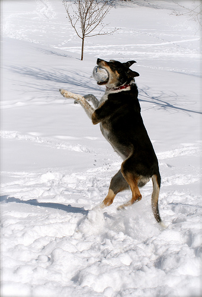

# Generating Captions for Images
## Project Description:
The project focuses on utilizing an advanced neural network to generate accurate captions for images.
The model was trained using the Flickr8k dataset.

## Training Methods:
During the training process, the VGG16 network was used to extract features from images, serving as one of the inputs to the trained network.
Additionally, the network architecture implemented a Long Short-Term Memory (LSTM) block, which effectively maintains the context of generated captions.
This solution allowed for the consideration of previous information and dependencies between words, resulting in more coherent and meaningful descriptions generated by the model.

## Implementation in PyTorch and Tensorflow:
To compare the effectiveness and flexibility of different tools, two identical models were implemented - one in the PyTorch library and the other in the Tensorflow library.

## Example results

  
   
  <em>dog runs through the snow</em>

  
   
  <em> young boy in the ocean </em>

